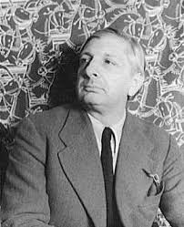

---
output:
  md_document:
    variant: markdown_github
---

<!-- README.md is generated from README.Rmd. Please edit that file -->

```{r, echo = FALSE}
knitr::opts_chunk$set(
  collapse = TRUE,
  comment = "#>",
  fig.path = "figure/",
  fig.height = 1
)
```

# ArtPalette 

`ArtPalette` is an R package designed to provide different color palettes based of famous painting. This package allows users to easily access and utilize color schemes derived from the works of renowned artists. 

## Giorgio De Chirico Palette

Giorgio de Chirico (1888-1978) was an Italian painter and a prominent figure in the metaphysical art movement, which he co-founded in the early 20th century. Born in Volos, Greece, de Chirico spent much of his childhood in Italy, where he developed a unique artistic style characterized by eerie, dreamlike landscapes and enigmatic figures. His works often feature classical architecture, long shadows, and a sense of stillness, evoking a sense of mystery and introspection.

<div style="float: right; margin-left: 20px;">  </div> ```

## Installation

``` r
devtools::install_github("billila/ArtPalette")
```

## Usage

```{r, palettes_dummy}
library("ArtPalette")

# See all palettes
names(gdc_palettes)
```

## Palettes

### PiazzaDItalia

```{r, PiazzaDItalia}
gdc_palette("PiazzaDItalia")
gdc_palette("PiazzaDItalia1939")
```

### LeMuseInquietanti

```{r, LeMuseInquietanti}
gdc_palette("LeMuseInquietanti")
```

### SoleSulCavalletto1972

```{r, SoleSulCavalletto1972}
gdc_palette("SoleSulCavalletto1972")
```

```{r, ggplot1, fig.height = 3}
library("ggplot2")
ggplot(mtcars, aes(factor(cyl), fill=factor(gear))) +  geom_bar() +
  scale_fill_manual(values = gdc_palette("SoleSulCavalletto1972"))
```
