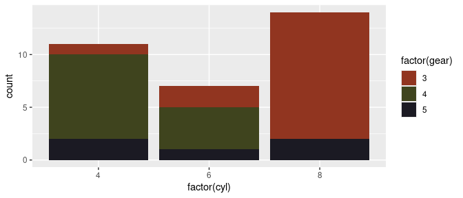

<!-- README.md is generated from README.Rmd. Please edit that file -->

# ArtPalette

## Giorgio De Chirico Palette

## Installation

``` r
devtools::install_github("billila/ArtPalette")
```

## Usage

``` r
library("ArtPalette")

# See all palettes
names(gdc_palettes)
#> [1] "PiazzaDItalia"         "LeMuseInquietanti"     "SoleSulCavalletto1972"
#> [4] "PiazzaDItalia1939"     "ArrivoDelTrasloco1965" "Zissou1Continuous"
```

## Palettes

### PiazzaDItalia

``` r
gdc_palette("PiazzaDItalia")
```


``` r
gdc_palette("PiazzaDItalia1939")
```


### LeMuseInquietanti

``` r
gdc_palette("LeMuseInquietanti")
```


### SoleSulCavalletto1972

``` r
gdc_palette("SoleSulCavalletto1972")
```


``` r
library("ggplot2")
ggplot(mtcars, aes(factor(cyl), fill=factor(gear))) +  geom_bar() +
  scale_fill_manual(values = gdc_palette("SoleSulCavalletto1972"))
```


